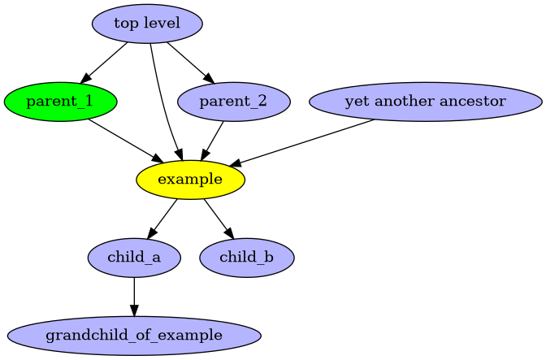

# visualize_callgraphs
This is a python-graphviz script that reads in a .json file that describes
which functions call which other functions, and generates a corresponding
.png image that shows that diagram.

Here is the image you'll get after running "make":

In order to get the right Python Graphviz support to be able to run this script,
here are a (very few!) examples of installation steps on various systems:

On Arch Linux:

	sudo pacman -S python-graphviz

On Ubuntu Linux:

	sudo apt install python3-graphviz

Examples:

	make

Display the resulting .png image in a browser:

	make d=1

Only build basic_example.png:

	make basic_example

A more extensive example, using some Linux kernel functions:

	make follow_page d=1

For more collections of call graphs, see also:
https://github.com/johnhubbard/kernel_callgraphs

Or, if you add your_diagram.json, the Makefile will pick it up automatically, so:

	make your_diagram

If you're using a browser other than firefox, try something like this:

	make your_diagram d=1 DISPLAY_PROGRAM=chromium
